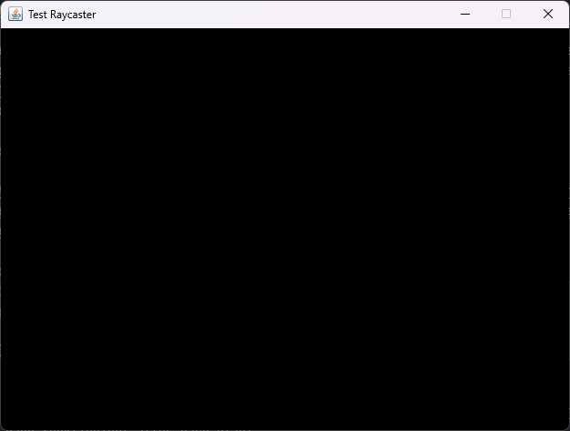

# Simple 3D Game Engine

Ich hab mich schon seit dem ich klein bin gefragt, wie Game Engines und vor
allem 3D Engines funktionieren. Eine große Inspiration dafür war schon immer
Minecraft, da es einer meiner liebsten Spiele aller Zeiten ist. In den letzten 
Jahren begann ich mich jedoch für die Doom Engine zu interessieren. Doom kann
überall laufen und das zeigt die Community auch immer wieder mit erstaunlichen
Projekten. Doom benutzt dafür eine sogennante Raycast Engine. In diesem
Repository möchte ich versuchen, eine ähnliche Engine zu bauen ohne Hilfsmittel
wie OpenGL oder Vulkan.

## Game Klasse

Die [Game.java](src/main/java/org/tobii/game/Game.java) Klasse ist die Klasse, in
der Sachen wie die Map oder die Game Loop enthalten sind. Die Klasse vererbt `JFrame`
da wir damit unser Fenster erstellen wollen. Dazu extended die Klasse `Runnable` da
solche Engines Single Threaded laufen und die [Game.java](src/main/java/org/tobii/game/Game.java)
Klasse diesen Thread enthält.

```java
private Thread gameThread;
private boolean gameRunning = true;
private BufferedImage bufferedImage;
public int[] pixel;
```

Wie schon angesprochen enthält unsere Klasse den `gameThread` und dazu noch eine `gameRunning` Variable
welche uns die Information gibt, ob das Spiel laufen soll oder nicht. Das BufferedImage
wird benötigt um unser Bild zu rendern. Ein `BufferedImage` speichert die Bilddaten als ein 2D Raster von Pixeln.
Jeder Pixel verfügt über eigene Farbwerte. Der Vorteil ist, dass das Bild vollständig im Speicher
geladen ist und somit schnelle Manipulationen an den Daten im Bild durchgeführt werden können.

### BufferedImages (Detail)

Ein `BufferedImage` kann verschiedene Typen haben:
* `BufferedImage.TYPE_BYTE_GRAY`: Graustufenbild
* `BufferedImage.TYPE_INT_RGB`: RGB-Bild
* `BufferedImage.TYPE_INT_ARGB`: ARGB-Bild mit Transparenz


Das Array `pixel` speichert die Farbwerte von jedem einzelnen Pixel in dem Spiel. Somit kann jeder Bereich
schnell und effizient bearbeitet werden. In diesem Spiel verwenden wir `BufferedImage.TYPE_INT_RGB` somit
werden Rot, Grün und Blau werte ohne Transparenz gespeichert. (Format: 0xRRGGBB)


### Map 
Natürlich brauchen wir noch eine Map damit der Spieler nicht ins Leere starren muss. Diese Engine wird keine richtigen
3D Objekte anzeigen, sondern nur ein "Pseudo" 3D. Hier werden wir eine 2D Map anfertigen, welche dann durch
Berechnungen für den Spieler 3D erscheint.

Source: https://github.com/vinibiavatti1/RayCastingTutorial

Für diese Map erstellen wir ein zwei-dimensionales Array aus Integern (int[][]).
```java
public int mapWidth = 15;
public int mapHeight = 15;
public static int[][] map = {
        {1, 1, 1, 1, 1, 1, 1, 1, 1, 1, 1, 1, 1, 1, 1},
        {1, 0, 0, 0, 0, 0, 0, 0, 0, 0, 0, 0, 0, 0, 1},
        {1, 0, 2, 2, 0, 0, 0, 0, 0, 0, 0, 0, 2, 2, 1},
        {1, 0, 0, 0, 0, 0, 0, 0, 2, 2, 0, 0, 0, 0, 1},
        {1, 0, 0, 0, 0, 0, 0, 0, 0, 0, 0, 0, 0, 0, 1},
        {1, 0, 0, 2, 2, 0, 0, 0, 0, 0, 0, 0, 0, 0, 1},
        {1, 0, 0, 0, 0, 0, 0, 0, 0, 0, 0, 2, 2, 0, 1},
        {1, 0, 0, 0, 0, 0, 0, 0, 0, 0, 0, 0, 0, 0, 1},
        {1, 0, 0, 0, 0, 0, 0, 0, 0, 2, 2, 0, 0, 0, 1},
        {1, 0, 0, 0, 0, 0, 0, 0, 0, 0, 0, 0, 0, 0, 1},
        {1, 0, 0, 0, 0, 0, 0, 0, 0, 0, 0, 0, 0, 0, 1},
        {1, 0, 0, 0, 0, 0, 0, 0, 2, 2, 0, 0, 0, 0, 1},
        {1, 0, 2, 2, 0, 0, 0, 0, 0, 0, 0, 0, 2, 2, 1},
        {1, 0, 0, 0, 0, 0, 0, 0, 0, 0, 0, 0, 0, 0, 1},
        {1, 1, 1, 1, 1, 1, 1, 1, 1, 1, 1, 1, 1, 1, 1}
};
```

Die `0` steht im Array für einen leeren Raum. Alle anderen Zahlen können dann zu Texturen zugewiesen werden, sobald
wir diese implementiert haben und angefangen haben das Spiel rendern zu lassen.


### Game Konstruktor

Im Konstruktor werden wir unsere Variablen initialisieren. Zusätzlich werden wir hier das Fenster in dem
das Spiel angezeigt wird einstellen.

```java
public Game() {
        gameThread = new Thread(this);
        bufferedImage = new BufferedImage(640, 480, BufferedImage.TYPE_INT_RGB);
        pixel = ((DataBufferInt) bufferedImage.getRaster().getDataBuffer()).getData();
    }
```

Als erstes weisen wir den `gameThread` einen neuen Thread hinzu und übergeben die [Game.java](src/main/java/org/tobii/game/Game.java)
Klasse, damit diese als Thread ausgeführt wird. Unser `bufferedImage` initialisieren wird und übergeben eine
`width`, eine `height` und einen BufferedImage Typen. Ich verwende hierbei jetzt `BufferedImage.TYPE_INT_RGB`.


Danach befüllen wir unser BufferedImage mit Daten. Hierfür steht die folgende Zeile:
```java
pixel = ((DataBufferInt) bufferedImage.getRaster().getDataBuffer()).getData();
```

Mit `.getRaster()` holen wir uns das Rasterobjekt von dem BufferedImage, indem die die Struktur der Pixel 
beschrieben ist. Danach können wir uns mit `.getDataBuffer()` den DataBuffer holen, welcher die Rohdaten der
einzelnen Pixel gespeichert hat. Hierzu gehören Farbwerte, die als Integers gespeichert werden. Da wir die werte
auch als Integer abspeichern wollen, casten wir das `DataBuffer`-Objekt auf ein `DataBufferInt`. Jetzt können
wir mit `.getData()` das Integer Array mit den Daten befüllen.

### Fenster initialisieren

Jetzt wollen wir unser Fenster initialisieren, worauf dann später das Spiel gerendert wird. Da wir die Klasse
um `JFrame` erweitert haben, können wir ganz einfach die benötigten Methoden aufrufen. Hierzu erweitern wir
unseren Konstruktur um ein paar Zeilen. Die sieht nun so aus:
```java
public Game() {
        gameThread = new Thread(this);
        bufferedImage = new BufferedImage(640, 480, BufferedImage.TYPE_INT_RGB);
        pixel = ((DataBufferInt) bufferedImage.getRaster().getDataBuffer()).getData();
        setSize(640,480); // Fenstergröße
        setResizable(false);
        setLocationRelativeTo(null);
        setTitle("Test Raycaster");
        setDefaultCloseOperation(JFrame.EXIT_ON_CLOSE);
        setVisible(true);
        start();
    }
```

Was die Methoden machen, sollte relativ selbsterklärend sein durch die Namen. Deshalb werde ich diese
nicht hier durchgehen. 

### Start/Stop Methoden

Damit wir kontrollieren können ob das Game läuft bzw ob Updates passieren sollen, fügen wir eine Start 
und eine Stop Methode hinzu. Diese sind sehr simpel aufgebaut:

```java
private synchronized void start() {
    gameRunning = true;
    gameThread.start();
}

public synchronized void stop() {
    gameRunning = false;
    try {
        gameThread.join();
    } catch (InterruptedException e) {
        e.printStackTrace();
    }
}
```

In der Startmethode wird `gameRunning` auf true gesetzt und der `gameThread` wird gestartet. Die
Stopmethode macht genau das Gegenteil.

### Render Methode

Vorhin haben wir unser BufferedImage initialisiert. Nun wollen wir dieses Bild auch im Fenster rendern können.
Dafür schreiben wir folgende Methode:

```java
public void render() {
    BufferStrategy bufferStrategy = getBufferStrategy();
    if (bufferStrategy == null) {
        createBufferStrategy(3);
        return;
    }
    Graphics g = bufferStrategy.getDrawGraphics();
    g.drawImage(bufferedImage, 0, 0, bufferedImage.getWidth(), bufferedImage.getHeight(),null);
    bufferStrategy.show(); // zeigt den aktuellen Buffer an
}
```

Als erstes initialisieren wir eine `BufferedStrategy`. Diese ermöglicht es uns den nächsten Frame
vorzurendern und somit das Bild nicht flackert. Durch `getBufferStrategy()` holen wir uns die aktuelle BufferStrategy
des Fensters und arbeitet mit dem weiter. Falls keine `BufferStrategy` vorhanden ist, wird eine neue erstellt.
In dem Fall erstellen wir 3 Buffer. Der dritte gilt als Reserve.

Jetzt brauchen wir einen Weg die Bilder anzeigen zu lassen. Dafür erstellen wir ein `Graphics` Objekt. Damit können
wir unsere `BufferStrategy` rendern lassen.

### Gameloop (Run Methode)

Natürlich müssen wir die Gamelogik und das Rendering jeden Frame ausführen. Hierzu schreiben wir ein Gameloop, dass
dies für uns tut. Hierfür implementieren wir `run()` welche wir aus `Runnable` implementiert haben. Die Methode
wird automatisch aufgerufen, sobald wir den Thread starten.

```java
@Override
public void run() {
    long lastTime = System.nanoTime();
    final double ns = 1000000000.0 / 60.0;
    double delta = 0;
    requestFocus();
    while (gameRunning) {
        long now = System.nanoTime();
        delta += (now - lastTime) / ns;
        lastTime = now;
        while (delta >= 1) {
            delta--;
        }
        render();
    }
}
```

Als erstes speichern wir die aktuelle Zeit in Nanosekunden (`lastTime`). Das werden wir brauchen, um die verstrichene Zeit
zwischen den Iterationen der Schleife festzustellen. Jetzt müssen wir die Dauer eines Frames berrechnen. Da ich 
60 FPS haben will teile ich hier 1.000.000.000 Nanosekunden (= 1 Sekunde) durch die Anzahl der gewollten Frames.
In unserem Fall ist diese Zahl ca. 16,67 ms pro Frame. Das Double `delta` speichert wie viele logische Updates basierend
auf der verstrichenen Zeit durchgeführt werden muss. 

Damit unser Fenster den Fokus für z.B.: Tastatureingaben bekommt, müssen wir noch die Methode `requestFocus()` aufrufen.
Nun machen wir eine While-Schleife, welche das Game updated, solange `gameRunning` auf `true` ist. In dieser setzen
wir die Systemzeit in Nanosekunden im `long now` und errechnen dadurch die neue `delta` in dem wir die verstrichene Zeit
durch die Zeit pro Frame dividieren und den Wert mit `delta` addieren.

In der verschatelten While-Schleife kann noch die Game-Logic geschrieben werden wie z.B.: Spielerbewegungen. Sobald
genug Zeit war für mindestens ein logisches Update (`delta` >= 1), dann wird `delta` wieder auf 0 gesetzt, damit die Logik
wirklich nur in dem Fall 60 Mal pro Sekunde aktualisiert wird. Am Ende der äußeren While-Schleife wird dann die `render()`
Methode ausgeführt um das Bild neuzuzeichnen.

## Game startbar machen

Damit wir nun unseren Fortschritt testen können, müssen wir die `Game()` Methode irgendwo aufrufen. Hierzu schreiben
wir eine Main-Methode in der [Main.java](src/main/java/org/tobii/game/Main.java) welche wir erstellen müssen.
Diese schaut folgendermaßen aus:

```java
public class Main {
    public static void main(String[] args) {
        Game game = new Game();
    }
}
```
Wenn wir jetzt das Spiel ausführen wird uns ein Fenster begrüßen. Wenn die Hintergrundfarbe des Fensters schwarz
ist, dann funktioniert alles nach Plan!

