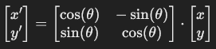
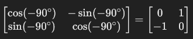
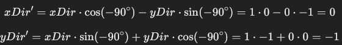

# Simple 3D Game Engine

Ich hab mich schon seit dem ich klein bin gefragt, wie Game Engines und vor
allem 3D Engines funktionieren. Eine große Inspiration dafür war schon immer
Minecraft, da es einer meiner liebsten Spiele aller Zeiten ist. In den letzten 
Jahren begann ich mich jedoch für die Doom Engine zu interessieren. Doom kann
überall laufen und das zeigt die Community auch immer wieder mit erstaunlichen
Projekten. Doom benutzt dafür eine sogennante Raycast Engine. In diesem
Repository möchte ich versuchen, eine ähnliche Engine zu bauen ohne Hilfsmittel
wie OpenGL oder Vulkan.

## Game Klasse

Die [Game.java](src/main/java/org/tobii/game/Game.java) Klasse ist die Klasse, in
der Sachen wie die Map oder die Game Loop enthalten sind. Die Klasse vererbt `JFrame`
da wir damit unser Fenster erstellen wollen. Dazu extended die Klasse `Runnable` da
solche Engines Single Threaded laufen und die [Game.java](src/main/java/org/tobii/game/Game.java)
Klasse diesen Thread enthält.

```java
private Thread gameThread;
private boolean gameRunning = true;
private BufferedImage bufferedImage;
public int[] pixel;
```

Wie schon angesprochen enthält unsere Klasse den `gameThread` und dazu noch eine `gameRunning` Variable
welche uns die Information gibt, ob das Spiel laufen soll oder nicht. Das BufferedImage
wird benötigt um unser Bild zu rendern. Ein `BufferedImage` speichert die Bilddaten als ein 2D Raster von Pixeln.
Jeder Pixel verfügt über eigene Farbwerte. Der Vorteil ist, dass das Bild vollständig im Speicher
geladen ist und somit schnelle Manipulationen an den Daten im Bild durchgeführt werden können.

### BufferedImages (Detail)

Ein `BufferedImage` kann verschiedene Typen haben:
* `BufferedImage.TYPE_BYTE_GRAY`: Graustufenbild
* `BufferedImage.TYPE_INT_RGB`: RGB-Bild
* `BufferedImage.TYPE_INT_ARGB`: ARGB-Bild mit Transparenz


Das Array `pixel` speichert die Farbwerte von jedem einzelnen Pixel in dem Spiel. Somit kann jeder Bereich
schnell und effizient bearbeitet werden. In diesem Spiel verwenden wir `BufferedImage.TYPE_INT_RGB` somit
werden Rot, Grün und Blau werte ohne Transparenz gespeichert. (Format: 0xRRGGBB)


### Map 
Natürlich brauchen wir noch eine Map damit der Spieler nicht ins Leere starren muss. Diese Engine wird keine richtigen
3D Objekte anzeigen, sondern nur ein "Pseudo" 3D. Hier werden wir eine 2D Map anfertigen, welche dann durch
Berechnungen für den Spieler 3D erscheint.

<br> Source: https://github.com/vinibiavatti1/RayCastingTutorial

Für diese Map erstellen wir ein zwei-dimensionales Array aus Integern (int[][]).
```java
public int mapWidth = 15;
public int mapHeight = 15;
public static int[][] map = {
        {1, 1, 1, 1, 1, 1, 1, 1, 1, 1, 1, 1, 1, 1, 1},
        {1, 0, 0, 0, 0, 0, 0, 0, 0, 0, 0, 0, 0, 0, 1},
        {1, 0, 2, 2, 0, 0, 0, 0, 0, 0, 0, 0, 2, 2, 1},
        {1, 0, 0, 0, 0, 0, 0, 0, 2, 2, 0, 0, 0, 0, 1},
        {1, 0, 0, 0, 0, 0, 0, 0, 0, 0, 0, 0, 0, 0, 1},
        {1, 0, 0, 2, 2, 0, 0, 0, 0, 0, 0, 0, 0, 0, 1},
        {1, 0, 0, 0, 0, 0, 0, 0, 0, 0, 0, 2, 2, 0, 1},
        {1, 0, 0, 0, 0, 0, 0, 0, 0, 0, 0, 0, 0, 0, 1},
        {1, 0, 0, 0, 0, 0, 0, 0, 0, 2, 2, 0, 0, 0, 1},
        {1, 0, 0, 0, 0, 0, 0, 0, 0, 0, 0, 0, 0, 0, 1},
        {1, 0, 0, 0, 0, 0, 0, 0, 0, 0, 0, 0, 0, 0, 1},
        {1, 0, 0, 0, 0, 0, 0, 0, 2, 2, 0, 0, 0, 0, 1},
        {1, 0, 2, 2, 0, 0, 0, 0, 0, 0, 0, 0, 2, 2, 1},
        {1, 0, 0, 0, 0, 0, 0, 0, 0, 0, 0, 0, 0, 0, 1},
        {1, 1, 1, 1, 1, 1, 1, 1, 1, 1, 1, 1, 1, 1, 1}
};
```

Die `0` steht im Array für einen leeren Raum. Alle anderen Zahlen können dann zu Texturen zugewiesen werden, sobald
wir diese implementiert haben und angefangen haben das Spiel rendern zu lassen.


### Game Konstruktor

Im Konstruktor werden wir unsere Variablen initialisieren. Zusätzlich werden wir hier das Fenster in dem
das Spiel angezeigt wird einstellen.

```java
public Game() {
        gameThread = new Thread(this);
        bufferedImage = new BufferedImage(640, 480, BufferedImage.TYPE_INT_RGB);
        pixel = ((DataBufferInt) bufferedImage.getRaster().getDataBuffer()).getData();
    }
```

Als erstes weisen wir den `gameThread` einen neuen Thread hinzu und übergeben die [Game.java](src/main/java/org/tobii/game/Game.java)
Klasse, damit diese als Thread ausgeführt wird. Unser `bufferedImage` initialisieren wird und übergeben eine
`width`, eine `height` und einen BufferedImage Typen. Ich verwende hierbei jetzt `BufferedImage.TYPE_INT_RGB`.


Danach befüllen wir unser BufferedImage mit Daten. Hierfür steht die folgende Zeile:
```java
pixel = ((DataBufferInt) bufferedImage.getRaster().getDataBuffer()).getData();
```

Mit `.getRaster()` holen wir uns das Rasterobjekt von dem BufferedImage, indem die die Struktur der Pixel 
beschrieben ist. Danach können wir uns mit `.getDataBuffer()` den DataBuffer holen, welcher die Rohdaten der
einzelnen Pixel gespeichert hat. Hierzu gehören Farbwerte, die als Integers gespeichert werden. Da wir die werte
auch als Integer abspeichern wollen, casten wir das `DataBuffer`-Objekt auf ein `DataBufferInt`. Jetzt können
wir mit `.getData()` das Integer Array mit den Daten befüllen.

### Fenster initialisieren

Jetzt wollen wir unser Fenster initialisieren, worauf dann später das Spiel gerendert wird. Da wir die Klasse
um `JFrame` erweitert haben, können wir ganz einfach die benötigten Methoden aufrufen. Hierzu erweitern wir
unseren Konstruktur um ein paar Zeilen. Die sieht nun so aus:
```java
public Game() {
        gameThread = new Thread(this);
        bufferedImage = new BufferedImage(640, 480, BufferedImage.TYPE_INT_RGB);
        pixel = ((DataBufferInt) bufferedImage.getRaster().getDataBuffer()).getData();
        setSize(640,480); // Fenstergröße
        setResizable(false);
        setLocationRelativeTo(null);
        setTitle("Test Raycaster");
        setDefaultCloseOperation(JFrame.EXIT_ON_CLOSE);
        setVisible(true);
        start();
    }
```

Was die Methoden machen, sollte relativ selbsterklärend sein durch die Namen. Deshalb werde ich diese
nicht hier durchgehen. 

### Start/Stop Methoden

Damit wir kontrollieren können ob das Game läuft bzw ob Updates passieren sollen, fügen wir eine Start 
und eine Stop Methode hinzu. Diese sind sehr simpel aufgebaut:

```java
private synchronized void start() {
    gameRunning = true;
    gameThread.start();
}

public synchronized void stop() {
    gameRunning = false;
    try {
        gameThread.join();
    } catch (InterruptedException e) {
        e.printStackTrace();
    }
}
```

In der Startmethode wird `gameRunning` auf true gesetzt und der `gameThread` wird gestartet. Die
Stopmethode macht genau das Gegenteil.

### Render Methode

Vorhin haben wir unser BufferedImage initialisiert. Nun wollen wir dieses Bild auch im Fenster rendern können.
Dafür schreiben wir folgende Methode:

```java
public void render() {
    BufferStrategy bufferStrategy = getBufferStrategy();
    if (bufferStrategy == null) {
        createBufferStrategy(3);
        return;
    }
    Graphics g = bufferStrategy.getDrawGraphics();
    g.drawImage(bufferedImage, 0, 0, bufferedImage.getWidth(), bufferedImage.getHeight(),null);
    bufferStrategy.show(); // zeigt den aktuellen Buffer an
}
```

Als erstes initialisieren wir eine `BufferedStrategy`. Diese ermöglicht es uns den nächsten Frame
vorzurendern und somit das Bild nicht flackert. Durch `getBufferStrategy()` holen wir uns die aktuelle BufferStrategy
des Fensters und arbeitet mit dem weiter. Falls keine `BufferStrategy` vorhanden ist, wird eine neue erstellt.
In dem Fall erstellen wir 3 Buffer. Der dritte gilt als Reserve.

Jetzt brauchen wir einen Weg die Bilder anzeigen zu lassen. Dafür erstellen wir ein `Graphics` Objekt. Damit können
wir unsere `BufferStrategy` rendern lassen.

### Gameloop (Run Methode)

Natürlich müssen wir die Gamelogik und das Rendering jeden Frame ausführen. Hierzu schreiben wir ein Gameloop, dass
dies für uns tut. Hierfür implementieren wir `run()` welche wir aus `Runnable` implementiert haben. Die Methode
wird automatisch aufgerufen, sobald wir den Thread starten.

```java
@Override
public void run() {
    long lastTime = System.nanoTime();
    final double ns = 1000000000.0 / 60.0;
    double delta = 0;
    requestFocus();
    while (gameRunning) {
        long now = System.nanoTime();
        delta += (now - lastTime) / ns;
        lastTime = now;
        while (delta >= 1) {
            delta--;
        }
        render();
    }
}
```

Als erstes speichern wir die aktuelle Zeit in Nanosekunden (`lastTime`). Das werden wir brauchen, um die verstrichene Zeit
zwischen den Iterationen der Schleife festzustellen. Jetzt müssen wir die Dauer eines Frames berrechnen. Da ich 
60 FPS haben will teile ich hier 1.000.000.000 Nanosekunden (= 1 Sekunde) durch die Anzahl der gewollten Frames.
In unserem Fall ist diese Zahl ca. 16,67 ms pro Frame. Das Double `delta` speichert wie viele logische Updates basierend
auf der verstrichenen Zeit durchgeführt werden muss. 

Damit unser Fenster den Fokus für z.B.: Tastatureingaben bekommt, müssen wir noch die Methode `requestFocus()` aufrufen.
Nun machen wir eine While-Schleife, welche das Game updated, solange `gameRunning` auf `true` ist. In dieser setzen
wir die Systemzeit in Nanosekunden im `long now` und errechnen dadurch die neue `delta` in dem wir die verstrichene Zeit
durch die Zeit pro Frame dividieren und den Wert mit `delta` addieren.

In der verschatelten While-Schleife kann noch die Game-Logic geschrieben werden wie z.B.: Spielerbewegungen. Sobald
genug Zeit war für mindestens ein logisches Update (`delta` >= 1), dann wird `delta` wieder auf 0 gesetzt, damit die Logik
wirklich nur in dem Fall 60 Mal pro Sekunde aktualisiert wird. Am Ende der äußeren While-Schleife wird dann die `render()`
Methode ausgeführt um das Bild neuzuzeichnen.

## Game startbar machen

Damit wir nun unseren Fortschritt testen können, müssen wir die `Game()` Methode irgendwo aufrufen. Hierzu schreiben
wir eine Main-Methode in der [Main.java](src/main/java/org/tobii/game/Main.java) welche wir erstellen müssen.
Diese schaut folgendermaßen aus:

```java
public class Main {
    public static void main(String[] args) {
        Game game = new Game();
    }
}
```
Wenn wir jetzt das Spiel ausführen wird uns ein Fenster begrüßen. Wenn die Hintergrundfarbe des Fensters schwarz
ist, dann funktioniert alles nach Plan!


## Texturen

Bevor wir mit den Rendering anfangen, müssen wir noch Texturen hinzufügen. Hierbei ist es wichtig, dass die Texturen
quadratisch sind (z.B.: 16x16, 32x32, ...). Dafür erstellen wir eine neue [Texture.java](src/main/java/org/tobii/game/Texture.java) Klasse.
Jetzt erstellen wir mal unsere benötigten Variablen.

```java
public class Texture {
    public int[] pixels;
    private String loc;
    public final int SIZE;
}
```

Das Integer-Array `pixels` speichert die einzelnen Daten der Pixel, damit wir sie später leichter Manipulieren können
fürs Rendering. Der Pfad zu der Textur wird in `loc` angegeben. In `SIZE` wird die Größe der Textur festgelegt (16x16 -> 16).
Nun müssen wir diese Variablen initialisieren. Das machen wir in unserem Konstruktor:

```java
public Texture(String loc, int size) {
    this.loc = loc;
    SIZE = size;
    pixels = new int[SIZE*SIZE];
}
```

Jetzt brauchen wir noch die Rohdaten der Textur. Dafür schreiben wir uns ganz einfach eine Methode `load()`, welche
diese ausliest.
```java
private void load() {
    try {
        BufferedImage bufferedImage = ImageIO.read(new File(loc));
        int width = bufferedImage.getWidth();
        int height = bufferedImage.getHeight();
        bufferedImage.getRGB(0,0,width,height,pixels,0,width);
    } catch (IOException e) {
        throw new RuntimeException(e);
    }
}
```

Hierzu nehmen wir natürlich wieder unser `BufferedImage` wo wir mit `ImageIO.read(new File(loc))` unser Bild 
einlesen. Nun können wir uns die Höhe und Breite des Bildes holen, sowie auch unser Array für die Pixel mit den Daten
befüllen. Diese Methode wird in unserem Konstruktor aufgerufen. Hier nun der fertige Konstruktor:

```java
public Texture(String loc, int size) {
    this.loc = loc;
    SIZE = size;
    pixels = new int[SIZE*SIZE];
    load();
}
```

Jetzt können wir in unserer [Texture.java](src/main/java/org/tobii/game/Texture.java) Klasse neue Texture-Objekte
erstellen und initialisieren. Ich hab hierfür 2 Texturen zu meinem [Resources](src/main/resources) Folder hinzugefügt
und am Anfang meiner Klasse diese als Objekte erstellt.

```java
public static Texture wood = new Texture("src/main/resources/wood.png", 16);
public static Texture brick = new Texture("src/main/resources/brick.png", 16);
```

Um diese später im Spiel anzeigen zu lassen müssen wir in unserer [Game.java](src/main/java/org/tobii/game/Game.java)
Klasse eine neue `ArrayList<Texture> textures` erstellen in denen wir unsere Texturen speichern.

```java
public ArrayList<Texture> textures;
```

Diese Liste befüllen wir in unserem Konstruktor der Klasse:

```java
textures = new ArrayList<Texture>();
textures.add(Texture.brick);
textures.add(Texture.wood);
```

## Kameraklasse

Damit wir Sachen wie `FOV (Field of View)` oder `Speed` einstellen können oder einfach durch die Map spazieren
können brauchen wir eine Kamera. Dafür erstellen wir eine neue [Kamera.java](src/main/java/org/tobii/game/Camera.java)
Klasse. Hier drinnen erstellen wir folgende Variablen:

```java
public double xPos, yPos, xDir, yDir, xPlane, yPlane;
public boolean left, right, forward, backward;
public final double MOVE_SPEED = .1;
public final double ROTATE_SPEED = .1;
```

Zuerst definieren wir Positions und Richtungsvektoren als `double` Wert. Für die Position des Spielers auf
unserer Map definieren wir `xPos` für die X-Koordinate und `yPos` für die Y-Koordinate. Die Richtung in der
der Spieler schaut wird über unsere Richtungsverktoren `xDir` und `yDir` angegeben. Um die FOV des Spielers
anzugeben haben wir die Kameraflächennormalen `xPlane` und `yPlane`. Für die Geschwindigkeit des Spielers
definieren wir die finale Variable `MOVE_SPEED`und für die Drehgeschwindigkeit `ROTATE_SPEED`.

Wir brauchen auch noch eine Möglichkeit zu wissen, ob der Spieler sich forwärts oder rückwärts bewegen
will bzw. ob sich der Spieler nach Rechts oder Links bewegen will. Dafür definieren wir die Variablen `forward`,
`backward` für die Bewegung und für die Drehung `left` und `right`. Diese Variablen werden bei Bedarf auf `true`
oder `false` gesetzt, je nachdem ob der Spieler die Aktion ausführen will oder nicht.

Alle Variablen werden in dem Konstruktor der Klasse initialisiert:

```java
public Camera(double xPos, double yPos, double xDir, double yDir, double xPlane, double yPlane) {
    this.xPos = xPos;
    this.yPos = yPos;
    this.xDir = xDir;
    this.yDir = yDir;
    this.xPlane = xPlane;
    this.yPlane = yPlane;
}
```

### Eingabeerkennung

Natürlich wollen wir unsere Tastatur auch verwenden können, um das Spiel zu steuern. Damit wir dies
erzielen können implementieren wir die Klasse `KeyListener`. Damit sollte unsere IDE (in meinem Fall
IntelliJ IDEA) die benötigten Funktionen importieren.

```java
@Override
public void keyTyped(KeyEvent e) {
    
}

@Override
public void keyPressed(KeyEvent e) {
    
}

@Override 
public void keyReleased(KeyEvent e) {
    
}
```

Die Funktion `keyTyped()` werden wir hier nicht gebrauchen. Beim Aufrufen der Methoden wird mit
`e.getKeyCode()` abgefragt, welche Taste gedrückt wurde. Wir benutzen das um in ein IF-Statement nachzufragen,
ob eine bestimmte Taste gedrückt wurde und reagieren dementsprechend darauf. In unserem Fall setzen wir unsere 
vorher angelegten `boolean` Variablen auf `true` oder `false`. Dies sieht folgendermaßen aus:

```java
@Override
public void keyPressed(KeyEvent e) {
    if (e.getKeyCode() == KeyEvent.VK_LEFT) left = true;
    if (e.getKeyCode() == KeyEvent.VK_RIGHT) right = true;
    if (e.getKeyCode() == KeyEvent.VK_UP) forward = true;
    if (e.getKeyCode() == KeyEvent.VK_DOWN) backward = true;
}

@Override 
public void keyReleased(KeyEvent e) {     
    if (e.getKeyCode() == KeyEvent.VK_LEFT) left = false;
    if (e.getKeyCode() == KeyEvent.VK_RIGHT) right = false;
    if (e.getKeyCode() == KeyEvent.VK_UP) forward = false;
    if (e.getKeyCode() == KeyEvent.VK_DOWN) backward = false;
}
```
Damit wir jetzt in jeder Iteration des Game Loops abprüfen können, ob eine Taste betätigt wurde,
schreiben wir eine Methode `update(int[][] map)`, welche in der Game-Logik-Block unserer [Game.java](src/main/java/org/tobii/game/Game.java)
Klasse aufgerufen wird und unsere Map übergeben bekommt. Hier werden wir in den IF-Statements unsere Aktionen
definieren.

```java
public void update(int[][] map) {
        // Vorwärts
        if (forward) {
            
        }

        // Rückwärts
        if (backward) {
            
        }

        // Rotation Rechts
        if (right) {
            
        }

        // Rotation Links
        if (left) {
            
        }
    }
```

### Bewegung (Vorwärts/Rückwärts)

Damit wir nicht einfach so durch Wände durchlaufen können, bauen wir noch eine kleine Collision-Detection ein.
Dafür Überprüfen wir jedes Mal wenn die Taste gedrückt ist, ob an der Stelle, an der sich der Spieler hinbewegen wird,
der Raum leer ist oder nicht. Wenn dieser leer ist, dann bewegt sich der Spieler in die Richtung in der gegebenen
Geschwindigkeit (Richtung * Geschwindigkeit). Dies sieht folgendermaßen für Vorwärts aus:

```java
if (forward) {
    if (map[(int)(xPos+xDir * MOVE_SPEED)][(int)yPos] == 0) {
        xPos += xDir * MOVE_SPEED;
    }
    if (map[(int)xPos][(int)(yPos+yDir * MOVE_SPEED)] == 0) {
        yPos += yDir * MOVE_SPEED;
    }
}
```

Das erste IF-Statement überprüft, ob Horizontal (X-Achse) in der Position, auf der der Spieler landen wird
sich etwas befindet. Wenn die nicht der Fall ist bewegt er sich fort. Selbes Spiel bei der Vertikalen bewegung.
Hier müssen wir nur das selbe für die Y-Achse überprüfen.

Das Selbe müssen wir für die Rückwärtsbewegung auch machen nur hier dürfen wir nicht zur der X- oder Y-Position 
addieren sondern müssen subtrahieren. Dies sieht wie folgt aus:

```java
// Rückwärts
if (backward) {
    if (map[(int)(xPos+xDir * MOVE_SPEED)][(int)yPos] == 0) {
        xPos += xDir * MOVE_SPEED;
    }
    if (map[(int)xPos][(int)(yPos+yDir * MOVE_SPEED)] == 0) {
        yPos += yDir * MOVE_SPEED;
    }
}
```

### Rotation (Links, Rechts)

Für die Rotation des Spielers brauchen wir erstmal ein bisschen mathematisches Verständis für das Vorgehen.
Wenn sich der Spieler nach links oder rechts drehen will, dann wird der `Blinkwinkel (Richtungsvektor (xDir,yDir))`
um einen bestimmten Winkel rotiert (für die Darstellung wird der Buchstabe Theta θ als Winkel verwendet). Die Rotation
des Punktes um den Winkel θ wird mit der 2D-Rotationsmatrix beschrieben:



`x'` und `y'` stellen hier die neuen X- und Y-Werte nach der Rotation da. `cos(θ)` stellt die Projektion auf die X-Achse da
bzw. wie stark die neue Position des Vektors entland der X-Achse liegt. 

Beispiel:

Man hat einen Vektor(1,0) (dieser liegt auf der X-Achse, weil x=1 und y=0). Wenn man diesen Vektor nun um den Winkel
θ dreht, dann zeigt dieser schräg in den Raum. Jetzt muss man den X-Anteil vom neuen Vektor berechnen und dafür
benutzen wir den Kosinus vom Winkel θ.

Das selbe müssen wir für die Y-Achse machen. Hier hingegen nehmen wir `sin(θ)` für die Projektion auf die Y-Achse.
Damit man sich das Ergebnis ein bisschen besser vorstellen kann, wenden wir die Rotationsmatrix für -90 Grad an.

Beispiel:

Die Rotationsmatrix für -90 Grad:



Anwendung auf den Vektor:



Nach der Drehung schaut der Spieler in die Richtung: (xDir',yDir') = (0,-1)

<br>
Das selbe müssen wir mit der Rotation der Kameraebene machen. Hier können wir die selbe
2D-Rotationsmatrix verwenden. Hier ist jedoch der Unterschied, dass wir uns hier den sichtbaren Bereich definieren
bzw. die "Breite" des Sichtfelds berechnen. Dieses wissen können wir im Code wie folgt anwenden:

```java
// Rotation Rechts
if (right) {
    double oldxDir = xDir;
    xDir += xDir * Math.cos(-ROTATE_SPEED) - yDir * Math.sin(-ROTATE_SPEED);
    yDir += oldxDir * Math.sin(-ROTATE_SPEED) + yDir * Math.cos(-ROTATE_SPEED);
    double oldxPlane = xPlane;
    xPlane = xPlane * Math.cos(-ROTATE_SPEED) - yPlane * Math.sin(-ROTATE_SPEED);
    yPlane = oldxPlane * Math.sin(-ROTATE_SPEED) + yPlane * Math.cos(-ROTATE_SPEED);
}
```

Unser Winkel θ wird hier mit unseren `ROTATE_SPEED` ersetzt. Damit wir nicht für `yDir` unser neues `xDir` anwenden,
deklarieren wir eine neue Variable `oldxDir` und wenden diese bei `yDir` an. Selbes Spiel gilt für die Plane. Damit
wir uns nach links drehen können müssen wir unser `ROTATE_SPEED` im positiv anwenden (+). Dies sieht folgendermaßen aus:

```java
// Rotation Links
if (left) {     
    double oldxDir = xDir;
    xDir += xDir * Math.cos(ROTATE_SPEED) - yDir * Math.sin(ROTATE_SPEED);
    yDir += oldxDir * Math.sin(ROTATE_SPEED) + yDir * Math.cos(ROTATE_SPEED);
    double oldxPlane = xPlane;
    xPlane = xPlane * Math.cos(ROTATE_SPEED) - yPlane * Math.sin(ROTATE_SPEED);
    yPlane = oldxPlane * Math.sin(ROTATE_SPEED) + yPlane * Math.cos(ROTATE_SPEED);
}
```

### Aufruf der Methode

Damit wir nun unsere Keyboardinputs anwenden können, müssen wir die `update()` Methode aufrufen. Dafür gehen wir
in unsere [Game.java](src/main/java/org/tobii/game/Game.java) und initialisieren und diese Aufrufen. 

```java
public class Game extends JFrame implements Runnable {
    // ...
    public Camera camera;
    // ...
    
    public Game() {
        // ...
        camera = new Camera(7, 7, 1, 0, 0, -.70);
        addKeyListener(camera);
        // ...
    }
}
```

Beim initialisieren des Kameraobjektes übergeben wir Startpositionswerte. Damit auch das Programm auf unsere
Eingaben hört, müssen wir das Objekt dem `addKeyListener()` übergeben.